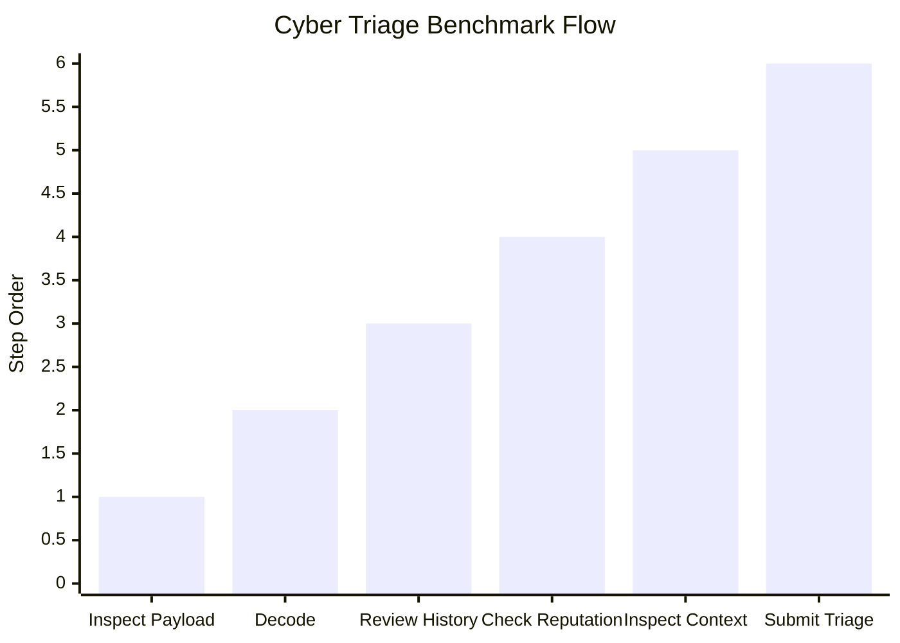
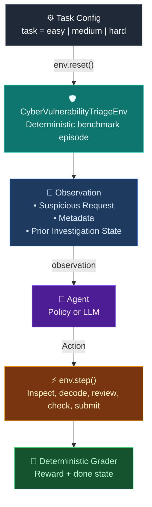

> [!NOTE]
> This repository is structured as an OpenEnv-compatible benchmark for deterministic cyber vulnerability triage and evaluation.

> [!TIP]
> Use `sec-openenv serve` or `make start` to launch the environment locally, then hit `/health`, `/reset`, and `/step` to demo it quickly.

# 🛡️ Cyber Vulnerability Triage Environment

A deterministic OpenEnv environment for evaluating how well AI agents investigate suspicious web requests, identify likely vulnerability classes, and recommend safe remediation actions under realistic application security triage workflows.



Security triage is not a one-shot classification task. Strong agents need to inspect evidence, separate signal from noise, investigate context, and make an operationally safe final decision. This environment turns that workflow into a reproducible benchmark with deterministic grading.

## Quick Start

The fastest way to interact with the environment in Python:

```python
import asyncio

from cyber_vulnerability_triage import CyberVulnerabilityTriageEnv


async def main() -> None:
    async with CyberVulnerabilityTriageEnv(base_url="http://localhost:8000") as env:
        result = await env.reset(task="hard")
        print(result.observation.request_id)

        await env.inspect_payload()
        await env.review_history()

        final = await env.submit_triage(
            vulnerability_type="xss",
            severity="medium",
            response_action="sanitize",
            explanation="Payload and context indicate reflected script injection.",
        )
        print(final.done, final.reward)


asyncio.run(main())
```

## Why This Problem Matters

Application security review rarely looks like a simple label prediction task. Real triage involves:

- **Evidence gathering** to inspect payloads, history, and asset context before making a decision.
- **Threat discrimination** to separate harmless anomalies from genuine exploit indicators.
- **Operational safety** to recommend the right response action without overreacting or missing risk.

Most security benchmarks are either toy datasets or one-step classifiers. This environment tests structured, multi-step reasoning in a way that is reproducible, benchmarkable, and useful for agent evaluation.

## Try It Now

The environment exposes a standard OpenEnv-style HTTP interface.

```bash
# Health check
curl http://localhost:8000/health

# View metadata
curl http://localhost:8000/metadata

# Start a task
curl -X POST http://localhost:8000/reset \
  -H "Content-Type: application/json" \
  -d '{"task":"medium"}'

# Submit an action
curl -X POST http://localhost:8000/step \
  -H "Content-Type: application/json" \
  -d '{"action_type":"inspect_payload"}'
```

## Agent Loop Architecture



## Tasks And Scenarios

The benchmark currently evaluates agents across three difficulty tiers.

| Task ID | Difficulty | Active Challenge | Core Competency Evaluated |
|---------|------------|------------------|---------------------------|
| `easy` | 🟢 Intro triage | Clear signal | Identifying obvious vulnerability patterns from direct evidence. |
| `medium` | 🟡 Multi-signal triage | Ambiguous context | Combining multiple clues and ruling out weaker explanations. |
| `hard` | 🔴 Adversarial triage | Obfuscated or misleading evidence | Performing deeper investigation and submitting a precise final decision. |

## Action And Observation Spaces

### Action: `Action`

| Field | Type | Description |
|-------|------|-------------|
| `action_type` | `str` | The selected investigation or submission action. |
| `vulnerability_type` | `str \| null` | Final predicted vulnerability class when submitting triage. |
| `severity` | `str \| null` | Final severity assessment when submitting triage. |
| `response_action` | `str \| null` | Recommended remediation or handling action. |
| `explanation` | `str \| null` | Free-text explanation supporting the final submission. |

### Observation: `Observation`

| Field | Type | Description |
|-------|------|-------------|
| `request_id` | `str` | Identifier for the current suspicious request. |
| `prompt` | `str` | Initial incident or request context presented to the agent. |
| `available_actions` | `list[str]` | Actions the agent can still take. |
| `done` | `bool` | Whether the episode has completed. |
| `reward` | `float` | Current reward signal for the episode. |

**Example observation payload:**

```json
{
  "observation": {
    "request_id": "req-1042",
    "prompt": "Investigate a suspicious request targeting a search endpoint with reflected script content.",
    "available_actions": [
      "inspect_payload",
      "decode_obfuscation",
      "review_history",
      "submit_triage"
    ]
  },
  "reward": 0.0,
  "done": false
}
```

## Reward Evaluation

The environment uses deterministic grading so results remain reproducible across runs and models.

- **Investigation quality** is rewarded when the agent gathers relevant context before submitting.
- **Decision accuracy** is rewarded when the submitted vulnerability type and severity match the underlying case.
- **Response quality** is rewarded when the proposed remediation is operationally appropriate.
- **Premature or incorrect submissions** are penalized.

This makes the benchmark suitable for controlled evaluation, regression testing, and side-by-side model comparison.

## Baseline Usage Flows

The repository supports several practical workflows:

| Flow | Command | Purpose |
|---|---|---|
| Local API demo | `make start` | Launch the FastAPI server for browser or curl-based demos. |
| Smoke test | `make smoke` | Verify the API is responding correctly. |
| Framework server | `sec-openenv serve` | Run the registry-managed OpenEnv server entrypoint. |
| Baseline benchmark | `python inference.py` | Evaluate the bundled baseline agent across tasks. |
| Client walkthrough | `python examples/clients/async_api_walkthrough.py` | See an end-to-end API interaction example. |

## Deployment And Setup

### Local Run

```bash
python -m venv .venv
source .venv/bin/activate
python -m pip install -U pip setuptools wheel
python -m pip install -e ".[dev]"
make start
```

### Docker

```bash
docker build -t cyber-openenv .
docker run -p 8000:8000 cyber-openenv
```

### OpenEnv-Compatible Serving

```bash
sec-openenv serve
```

The server exposes the standard benchmark endpoints including `/health`, `/reset`, `/step`, `/state`, `/tasks`, and `/metadata`.

## Repository Map

| Path | Purpose |
|---|---|
| `src/sec_openenv/` | Framework package, CLI, registry, and environment plumbing. |
| `src/cyber_vulnerability_triage/` | Public package exports for the benchmark client and environment. |
| `env/` | Core environment state, tasks, data, and scoring logic. |
| `server/` | FastAPI app and landing page. |
| `examples/` | Client demos and benchmark walkthroughs. |
| `tests/` | Regression coverage. |
| `docs/` | Architecture and contributor-facing docs. |

## Roadmap

- **More environments**: extend the framework with additional security workflows beyond vulnerability triage.
- **Stronger eval tooling**: improve benchmark runners, result aggregation, and model comparison flows.
- **Richer task sets**: add more deterministic cases, deeper obfuscation patterns, and broader exploit classes.
- **Extensibility improvements**: make it easier for contributors to register and ship new environments.
- **Better demos**: continue polishing docs, deployment, and hosted showcase flows.

## Citation

```bibtex
@software{secopenenv2026,
  title   = {Sec-OpenEnv: A Deterministic Cyber Vulnerability Triage Environment},
  author  = {Tejas},
  year    = {2026},
  url     = {[https://github.com/tejas49167-ui/OpenEnv-SEC]},
  note    = {OpenEnv-compatible benchmark for multi-step cyber triage}
}
```
