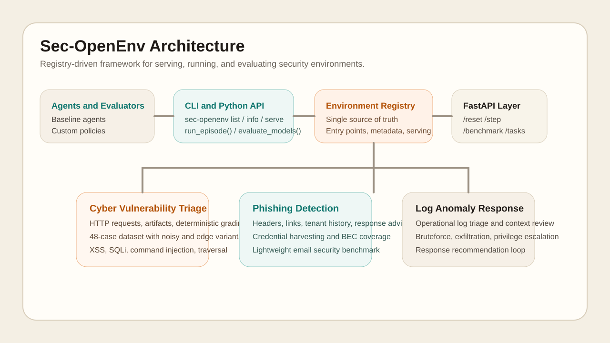

# Sec-OpenEnv

Sec-OpenEnv turns security workflows into reproducible environments for AI agents.

It is a security-focused environment framework inspired by OpenEnv principles: registry-driven environments, deterministic tasks, HTTP serving, and evaluation loops that make agent behavior benchmarkable instead of anecdotal.



## Why This Matters

Most security-agent repos stop at one of two places:

- a one-off benchmark with framework language around it
- a polished demo with no reusable environment contract

Sec-OpenEnv is built to sit in the middle ground that actually compounds:

- realistic security workflows packaged as environments
- a single registry that drives discovery, serving, and metadata
- a clean CLI and Python API for demos, evaluation, and future extensions
- lightweight but real multi-domain coverage out of the box

The goal is not to be a weaker OpenEnv clone. The goal is to bring OpenEnv-style environment discipline to security workflows, where reproducibility, evidence gathering, and safe operational decisions actually matter.

## What Ships Today

- `cyber-vulnerability-triage`: web application security triage over suspicious HTTP requests, with deterministic grading and an expanded dataset
- `log-anomaly`: operational detection workflow for log triage, context review, and response recommendation

Each environment includes:

- a dataset
- typed observation and action models
- an environment class
- a registry entry
- a FastAPI server entrypoint
- a minimal baseline agent for evaluation

## Architecture

```text
                         +-----------------------------+
                         |   sec-openenv CLI / API     |
                         | list | info | serve | eval  |
                         +-------------+---------------+
                                       |
                                       v
                         +-----------------------------+
                         |     Environment Registry    |
                         | single source of truth for  |
                         | metadata, entrypoints, app  |
                         +------+------+---------------+
                                |      |
                +---------------+      +------------------+
                |                                      |
                v                                      v
   +-------------------------------+      +-------------------------------+
   | Cyber Vulnerability Triage    |      | Log Anomaly Investigation      |
   | request -> evidence -> action |      | event -> context -> response   |
   +---------------+---------------+      +---------------+---------------+
                   |                                      |
                   +------------------+-------------------+
                                      |
                                      v
                     +-----------------------------------+
                     | FastAPI Serving + Evaluation Loop |
                     | /reset /step /tasks /benchmark    |
                     +-----------------------------------+
```

Assets:

- [Architecture diagram](docs/assets/architecture.svg)
- [CLI screenshot](docs/assets/cli-screenshot.svg)
- [API response example](docs/assets/api-response-example.json)

## Repo Layout

```text
src/sec_openenv/
  core/           shared framework contracts and loaders
  framework/      registry and environment discovery
  environments/   bundled security environments
  server/         reusable FastAPI app factory
  evaluation/     run_episode() and multi-model evaluation

env/              compatibility shims for the original benchmark surface
server/           compatibility server entrypoints
examples/         runnable demos and evaluation scripts
tests/            environment, registry, and API contract checks
docs/assets/      architecture and demo assets
```

## Demo Commands

Install locally:

```bash
python -m pip install -e ".[dev]"
```

Optional OpenAI-compatible client for `evaluate_models` / LLM baselines:

```bash
python -m pip install -e ".[llm]"
```

Discover the framework:

```bash
sec-openenv list
sec-openenv info --environment cyber-vulnerability-triage
sec-openenv info --environment log-anomaly
```

Run a local episode:

```bash
python examples/benchmark/run_single_episode.py
```

Run multi-model evaluation:

```bash
python examples/evaluate_multiple_models.py
```

Serve an environment:

```bash
sec-openenv serve --environment cyber-vulnerability-triage --port 8000
sec-openenv serve --environment log-anomaly --port 8001
```

Probe the API:

```bash
curl http://localhost:8000/health
curl http://localhost:8000/benchmark
curl -X POST http://localhost:8000/reset \
  -H "Content-Type: application/json" \
  -d '{"task":"hard","seed":2}'
curl -X POST http://localhost:8000/step \
  -H "Content-Type: application/json" \
  -d '{"action_type":"inspect_payload"}'
```

## Real-World Use Case

Imagine evaluating an agent that acts like an application security analyst:

1. It receives a suspicious HTTP request from a shared queue.
2. It inspects payloads, historical activity, and asset context.
3. It submits a triage with vulnerability type, severity, and response action.
4. The result is scored deterministically, so prompt changes and model upgrades can be compared cleanly.

That same framework surface can host an email security workflow or a detection-engineering workflow without changing the CLI or evaluation loop.

## Comparison

Compared with a typical security benchmark repo:

- Sec-OpenEnv has multiple environments under one contract, not one benchmark plus scaffolding.
- Registry metadata powers `list`, `info`, and `serve`, so serving is not hardcoded to one app.
- Evaluation is reusable across environments through `run_episode()` and `evaluate_models()`.
- The repo ships CI, contribution docs, roadmap, changelog, and visual assets to feel maintainable, not disposable.

Compared with a typical polished demo repo:

- environments are deterministic and testable
- the API surface is stable and scriptable
- new domains can be added without rewriting the framework layer

## Python API

```python
from sec_openenv import run_episode, evaluate_models

trace = run_episode("cyber-vulnerability-triage", task="hard", seed=2)
print(trace.score, trace.steps)

results = evaluate_models(
    "cyber-vulnerability-triage",
    ["gpt-4o-mini", "gpt-4.1-mini"],
    task="hard",
    episodes=2,
)
print(results)
```

## Extending The Framework

To add a new environment:

1. Create a package under `src/sec_openenv/environments/<your_env>/`.
2. Add typed models, a dataset, an environment class, a baseline agent, and a server module.
3. Register it in `src/sec_openenv/framework/registry.py`.
4. Add one example and one smoke test.

The registry is the single source of truth. If an environment is not in the registry, it is not part of the framework surface.

## Ecosystem Signals

- [CONTRIBUTING.md](CONTRIBUTING.md)
- [CODE_OF_CONDUCT.md](CODE_OF_CONDUCT.md)
- [ROADMAP.md](ROADMAP.md)
- [CHANGELOG.md](CHANGELOG.md)
- [docs/architecture.md](docs/architecture.md)
- [docs/extensibility.md](docs/extensibility.md)

## Validation

```bash
pytest
```
